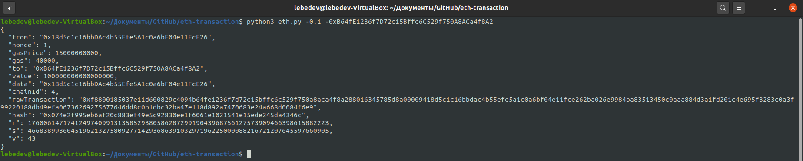

# Получение JSON транзакции для отправления в сети Ethereum

## Описание программы
В программу "зашит" секретный ключ от Ethereum адреса. Программа принимает параметрами количество ETH, которое необходимо отправить и адрес назначения. На выходе программа печатает в консоль результат - подписанную транзакцию в формате JSON, которую можно отправить в сети Ethereum, а также создает JSON файл подписанной транзакции.
https://park.mail.ru/curriculum/program/lesson/14834/#homework_5098

Файл `transaction.json` может использоваться для передачи ETH в тестовой сети Rinkeby. Однако, после каждой совершенной транзакции, если Вы хотите сгенерировать новый файл подписанной транзакции, необходимо увеличить число Nonce на 1 в eth.py.

## Конфигурация
Программа получает на вход два аргумента: `количество отправляемого ETH` и `адрес назначения`.

## Сборка
Собирать проект не надо, однако перед запуском необходимо установить библиотеку "web3" командой `pip install web3`.

## Запуск
Чтобы запустить проект в командной строке напишите (без "<, >"):
> python3 eth.py -<количество отправляемого ETH> -<адрес назначения>

Пример запуска:
> python3 eth.py -0.1 -0xB64fE1236f7D72c15Bffc6C529f750A8ACa4f8A2

## Пример запуска, работы программы

## Используемые несистемные библиотеки
web3 (https://pypi.org/project/web3/)
